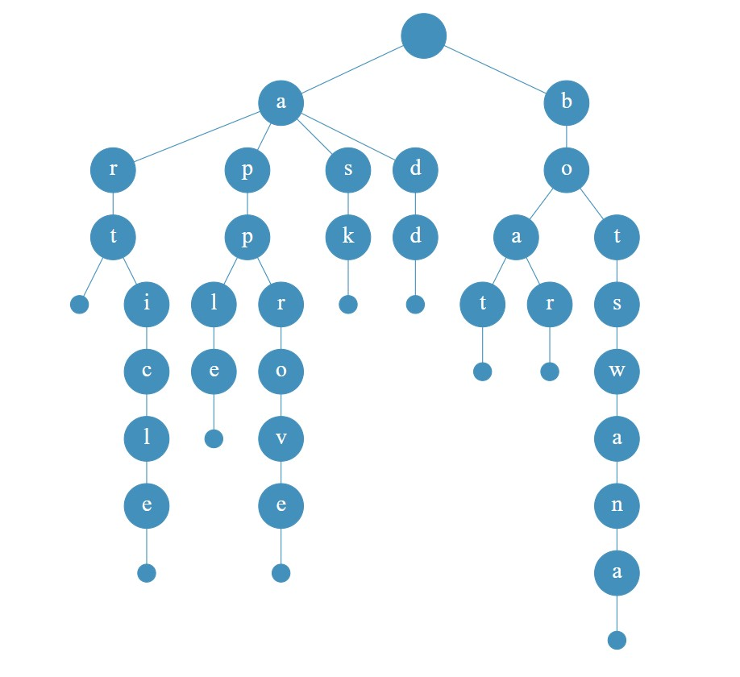

# Autocomplete using Trie

We have seen word-suggestions given to us by a lot of software, ever wondered how its done? There is a data structure called Trie which is used to store words and then used to suggest words very efficiently. We are going to see how such a system can be made.

Python will be used to implement the Trie data structure and then we will use it to make a word-suggestion API using FastAPI.

## What is a Trie?

A Trie is a tree-like data structure, with each node having a character and a list of children. If we were to trace from the root-node to a leaf-node, we would get a complete word.

Here is a Trie for the words

```
art apple article boat boar botswana approve ask add
```



## World list

We need a list of words to build our Trie. I used [this one](data/words.txt). Also we will filter out words with length less than 4 later.

## Code Structure
